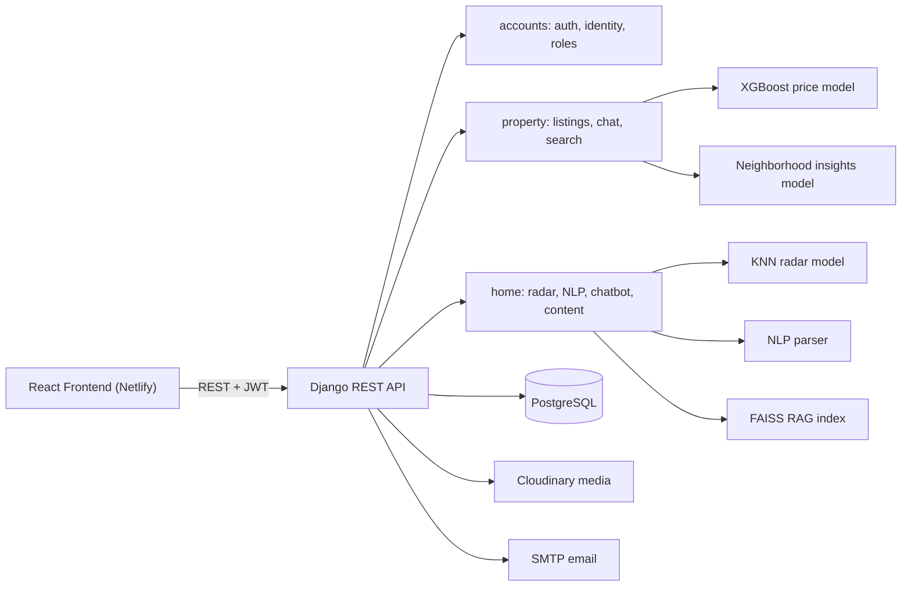
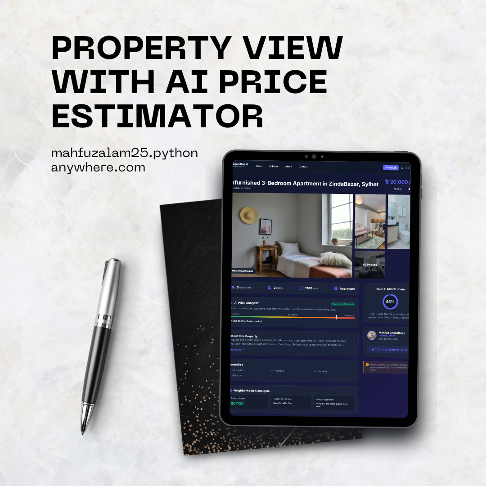
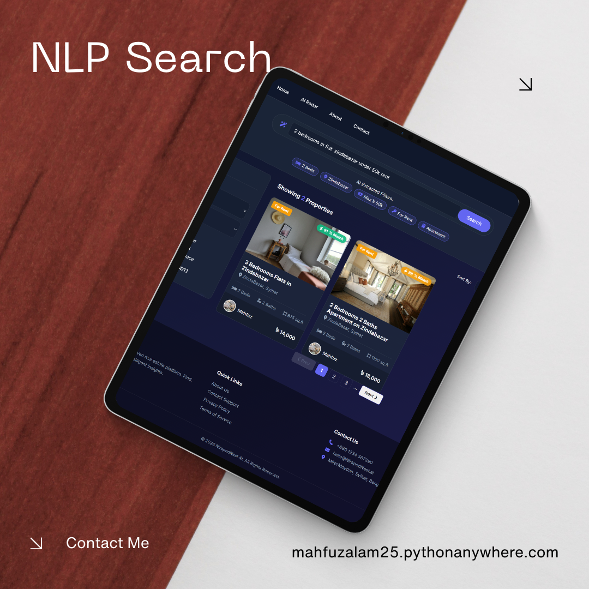

<div align="center">


# NirapodNest AI

### Zero-Broker, Fraud-Resistant Real Estate Platform Powered by Machine Learning

*Verified owners. Direct deals. AI-backed prices. No middlemen.*

[](https://nirapodnest-ai-property-management.netlify.app/)


</div>

 <p align="center"></p>

---

## 📖 Overview

In many cities, renters and buyers lose money to **fake listings and broker middlemen**, while honest property owners have no trusted way to reach real tenants.

**NirapodNest** (*Nirapod* = "safe" in Bengali) removes that gap. It is a full-stack PropTech platform where **verified owners list directly**, **buyers talk to owners directly**, and **AI** helps everyone price, search and discover properties fairly. The project began as *SylhetStay* and was renamed NirapodNest.

> 👨‍💻 **Built individually** by me, from the ML models and REST backend to the security design. This repository contains the **Django REST API and AI services**.

🔗 **Live frontend:** https://nirapodnest-ai-property-management.netlify.app/

---

## 🏆 Highlights

| | |
|---|---|
| 🛡️ **Fraud-resistant by design** | Identity hashing, duplicate-identity detection and automatic property-hijack blocking |
| 🧠 **5 AI features in one API** | KNN recommender, XGBoost price estimator, neighborhood insights, NLP search, RAG chatbot |
| 📈 **Measured results** | R² **0.87** price model, **99.24%** average top-1 radar match across 1,440 test queries |
| 🔐 **Modern auth** | OTP-gated onboarding, JWT with refresh rotation, owner / user roles |
| 💬 **Direct owner ↔ buyer messaging** | Built-in chat with email-alert cooldowns, no third-party chat service |
| 🔔 **AI Market Radar** | Users save criteria and get notified the moment a matching property is listed |
| 🧩 **Modular architecture** | Three decoupled Django apps: `accounts`, `property`, `home` |

---

## 🧠 AI & Machine Learning

Every model below runs inside the API. Metrics come from my own evaluation notebooks.

### 1. AI Market Radar: KNN Recommender

Content-based filtering that matches new listings against a user's saved search.

| Item | Value |
|---|---|
| Algorithm | K-Nearest Neighbors (content-based filtering) |
| Distance metric | Cosine similarity |
| Avg. top-1 match percentage | **99.24%** |
| Avg. top-5 match percentage | **97.82%** |
| Properties in catalog | 27,359 |
| Test queries processed | 1,440 |

> "Match percentage" is the average cosine-similarity score of the returned recommendations, not a classification accuracy.

### 2. XGBoost Price Estimator

Suggests a fair asking price so owners don't overprice and buyers don't get scammed.

| Item | Value |
|---|---|
| Algorithm | XGBoost Regressor in an sklearn `Pipeline` |
| Target transformation | `log1p` |
| Mean Absolute Error | 2,882.37 BDT |
| Root Mean Squared Error | 8,272.92 BDT |
| **R² score** | **0.8698** |
| Test set size | 4,320 |

**Feature correlations**

| | area_sqft | bedrooms | bathrooms | price_bdt |
|---|---|---|---|---|
| **area_sqft** | 1.00 | 0.77 | 0.81 | 0.75 |
| **bedrooms** | 0.77 | 1.00 | 0.76 | 0.43 |
| **bathrooms** | 0.81 | 0.76 | 1.00 | 0.48 |
| **price_bdt** | 0.75 | 0.43 | 0.48 | 1.00 |

**Dataset snapshot**

| | area_sqft | bedrooms | bathrooms | price_bdt |
|---|---|---|---|---|
| mean | 1057.35 | 2.51 | 2.37 | 21,009.27 |
| std | 477.81 | 0.60 | 0.76 | 21,495.92 |
| min | 200 | 1 | 1 | 5,500 |
| 25% | 700 | 2 | 2 | 13,000 |
| 50% | 900 | 2 | 2 | 16,000 |
| 75% | 1,250 | 3 | 3 | 22,000 |
| max | 6,300 | 6 | 8 | 650,000 |

Training data: Dhaka house-rent listings and Chittagong real-estate data.

### 3. NLP "Speak-to-Search"

Replaces rigid filter forms with plain language. A regex layer plus a pre-trained parser turns text into structured filters.

| Query | Type | Location | Bedrooms | Max price (BDT) |
|---|---|---|---|---|
| "I am looking for a 3 bed flat in Zindabazar under 25k" | flat ✅ | zindabazar ✅ | 3 ✅ | 25,000 ✅ |
| "Show me a store in Amberkhana max 50 thousand" | store ✅ | amberkhana ✅ | any (none stated) | 50,000 ✅ |

### 4. Neighborhood Insights Engine

Analyzes walkability, population density, and distance to transit and hospitals to produce a safety score out of 100, a traffic prediction and a value-trend projection.

```json
{
  "walkability_badge": "Highly Pedestrian Friendly",
  "walkability_description": "Most errands can be accomplished on foot.",
  "vibe_badge": "Bustling City Center",
  "commute_highlight": "Only 1.2km from Chittagong Central Bus Terminal",
  "healthcare_highlight": "0.5km to Evercare Hospital"
}
```

### 5. RAG FAQ Chatbot (FAISS)

Answers platform questions instantly using semantic search over the FAQ. It uses `all-MiniLM-L6-v2` embeddings from `langchain_huggingface` and a pre-computed FAISS index loaded into memory at startup.

| Question | Top retrieved passage |
|---|---|
| "How much does it cost to post an ad?" | Posting standard property ads is free for owners, with zero broker fees |
| "Is my NID safe with you?" | Verification: NID or passport is processed securely and never shared |
| "How does the Market Radar work?" | Users set up a radar (e.g. 3 bed flat under 25k) and get an instant alert on a match |

---

## 🏗️ Architecture



### Project structure

```
NirapodNest/
├── NirapodNest/        # Project config (settings, urls, wsgi)
├── accounts/           # Onboarding, identity verification, profiles
├── property/           # Listings, search, messaging, ML valuation
├── home/               # Radar alerts, NLP search, chatbot, banners, contact
├── model_folder/       # Serialized ML artifacts (see below)
├── build.sh            # Deployment build script
├── manage.py
└── requirements.txt
```

**`model_folder/` artifacts**

| File | Used for |
|---|---|
| `price_estimation_xgb_model.joblib` | XGBoost price estimation |
| `neighborhood_insights_engine.joblib` | Neighborhood insights |
| `radar_knn_model.joblib` | KNN recommender |
| `radar_preprocessor.joblib` | Radar feature preprocessing |
| `radar_property_catalog.joblib` | Property catalog for the radar |
| `nlp_search_parser.joblib` | NLP query parser |
| `sylhetstay_faq_faiss_index/` | FAISS vector index for the chatbot |

---

## 🔐 Security & Anti-Fraud Design

| Protection | How it works |
|---|---|
| **OTP-gated signup** | `/signup/` sends a 4-digit email OTP. The account activates and JWTs are issued only after `/verify-otp/` succeeds |
| **Identity hashing** | NID / passport numbers are hashed with SHA-256 (`set_identity`) and never stored in plain text |
| **Duplicate identity detection** | One identity hash cannot be reused across accounts |
| **Property-hijack prevention** | If a new owner claims an address already owned by someone else, the backend checks `FamilyMember` links. With no relationship found, the email is added to `BannedEmail`, the account is suspended and flagged for admin review |
| **Role-gated posting** | Only `owner` profiles can create listings, and location is taken from the owner's verified `Address` to prevent location spoofing |
| **Cached password reset** | Reset OTPs live in the cache with a 5-minute expiry |
| **Refresh-token rotation** | Refresh tokens rotate on use |
| **UUID public routing** | Public URLs use UUIDs instead of sequential IDs |

---

## 📦 Modules

### `accounts`: identity & access

- **`Profile`**: role (`user` / `owner`), verification status, professional details, public UUID
- **`Address`**: multiple types (present / permanent) per profile, down to ward and floor
- **`FamilyMember`**: dependents linked to a profile for tenant verification
- **`OwnerDetail`**: owner-only extension (building names, target demographics)

| Endpoint | Method | Purpose | Access |
|---|---|---|---|
| `/signup/` | POST | Register and send OTP | Public |
| `/verify-otp/` | POST | Validate OTP and issue JWTs | Public |
| `/login/` | POST | Authenticate active users | Public |
| `/complete-profile/` | POST | Submit identity, addresses, owner details | Authenticated |
| `/profile/me/` | GET | Full private profile | Authenticated |
| `/profile/public/<uid>/` | GET | Sanitized public profile | Public |
| `/profile/avatar/` | POST | Upload avatar to Cloudinary | Authenticated |
| `/password-reset/request/` | POST | Start OTP reset flow | Public |

### `property`: listings, search & messaging

- **`Property`**: UUID-routed listing with standard metrics plus ML-input fields (`walkability_score`, `population_density_band`, hospital and station proximity)
- **`PropertyImage`**: multiple photos via `CloudinaryField`
- **`ChatConversation`** and **`ChatMessage`**: buyer ↔ owner threads per property, with read/unread tracking
- **Advanced search**: exact match, partial text (`Q` objects), price and bed bounds, dynamic sorting
- **Radar trigger**: creating a listing checks all active `AIRadarAlert` records and sends notifications and emails to matches
- **Smart email cooldown**: at most one email alert per 30 minutes per conversation, to prevent inbox flooding

| Endpoint | Method | Purpose | Access |
|---|---|---|---|
| `/api/property/create/` | POST | Create listing and trigger radar alerts | Owner |
| `/api/property/estimate-price/` | POST | XGBoost price prediction | Public |
| `/api/property/neighborhood-ai/` | POST | Safety and walkability insights | Public |
| `/api/property/search/` | GET | Filter by budget, location, specs | Public |
| `/api/property/details/<uid>/` | GET | Single listing details | Public |
| `/api/property/message/<uid>/` | POST | Start a chat thread | Authenticated |
| `/api/property/chat/<uid>/` | GET / POST | Read or send messages | Authenticated |
| `/api/property/inbox/` | GET | Active threads for the user | Authenticated |

### `home`: AI operations & platform content

- **`AIRadarAlert`** and **`RadarNotification`**: saved criteria and the generated alert inbox
- **`HeroBanner`** and **`AdBanner`**: admin-editable homepage content with no frontend redeploy
- **`ContactMessage`**: categorized inquiries (general, technical, billing, report)
- **Built-in helpdesk**: typing a reply in the Django admin sends a formatted email to the user and marks the ticket as replied
- **Cron-ready radar**: a secret-key-protected endpoint runs the `send_radars` management command for background matching

| Endpoint | Method | Purpose | Access |
|---|---|---|---|
| `/api/home/radars/` | GET / POST | List or create radars | Authenticated |
| `/api/home/radars/<uid>/` | PATCH / DELETE | Toggle or delete a radar | Authenticated |
| `/api/home/notifications/` | GET | Latest unread alerts | Authenticated |
| `/api/home/content/banners/` | GET | Hero and ad banners | Public |
| `/api/home/nlp-search/` | POST | Text query to structured filters | Public |
| `/api/home/contact/submit/` | POST | Submit contact form | Public |
| `/api/home/contact/chatbot/` | POST | FAISS-powered FAQ answers | Public |
| `/api/home/trigger-radars/` | GET | Fire radar matching job | Secret key |

> All protected routes require `Authorization: Bearer <access_token>`.

---

## 🧰 Tech Stack

| Layer | Technology |
|---|---|
| Backend | Django 6.0, Django REST Framework 3.16 |
| Auth | `djangorestframework-simplejwt` |
| Database | PostgreSQL (`dj-database-url`, `psycopg2-binary`) |
| ML / AI | XGBoost, scikit-learn, pandas, joblib, PyTorch, Transformers, sentence-transformers |
| RAG | LangChain, `langchain-huggingface`, FAISS (`faiss-cpu`) |
| Media | Cloudinary |
| Serving | Gunicorn, WhiteNoise, django-cors-headers |
| Email | SMTP (Gmail) |
| Frontend | React, deployed on Netlify |

---

## 🚀 Getting Started

### Prerequisites
Python 3.12+, PostgreSQL, a Cloudinary account, and the `model_folder/` artifacts listed above.

### Setup

```bash
git clone https://github.com/mahfuzalam25/<repo-name>.git
cd <repo-name>

python -m venv venv
source venv/bin/activate          # Windows: venv\Scripts\activate
pip install -r requirements.txt
```

### Environment variables

Create a `.env` file next to `manage.py`:

```env
SECRET_KEY=your-secret-key
DEBUG=True
ALLOWED_HOSTS=localhost,127.0.0.1

DB_NAME=nirapodnest
DB_USER=postgres
DB_PASSWORD=your-password
DB_HOST=localhost
DB_PORT=5432
# DATABASE_URL=postgres://...      # used when DEBUG=False

CLOUDINARY_CLOUD_NAME=...
CLOUDINARY_API_KEY=...
CLOUDINARY_API_SECRET=...

EMAIL_HOST_USER=you@gmail.com
EMAIL_HOST_PASSWORD=your-app-password

CRON_SECRET_KEY=a-long-random-string
```

### Run

```bash
python manage.py migrate
python manage.py createsuperuser
python manage.py runserver
```

### Production

```bash
gunicorn NirapodNest.wsgi:application
```

Schedule a request to `/api/home/trigger-radars/` (with your secret key) from any cron service to process radar alerts.

---

## 📸 Screenshots

<!-- Add images to docs/screenshots/ and replace the placeholders -->

| Market Radar | AI Price Estimator | NLP Search |
|---|---|---|
| <p align="center"></p> | <p align="center"></p> | <p align="center"></p> |

---

## 👤 Author

**Mahfuz Alam Chowdhury**
Full-Stack Software Engineer (Python/Django, Flutter, AI integration)
Chairperson, IEEE Computer Society, Leading University Student Branch
Sylhet, Bangladesh

- 🌐 GitHub: [github.com/mahfuzalam25](https://github.com/mahfuzalam25)
- 💼 LinkedIn: [linkedin.com/in/md-mahfuz-alam-chowdhury](https://www.linkedin.com/in/md-mahfuz-alam-chowdhury)
- 📧 Email: [mahfuzalam.chowdhury.se@gmail.com](mailto:mahfuzalam.chowdhury.se@gmail.com)
- 🏢 Portfolio: [mahfuzalam25.pythonanywhere.com](https://mahfuzalam25.pythonanywhere.com/)

---

<div align="center">

⭐ If this project interests you, consider giving it a star.

</div>
